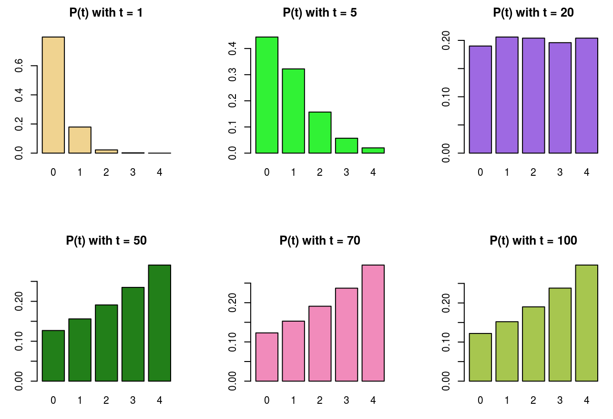

<!-- -->

# My professionoal journey so far 
1. [Bayer Crop Science](#bayer-crop-science)
2. [Enterprise Holdings](#enterprise)
3. [Teaching](#washu)
4. [Medical College of Wisconsin (Internshp)](#mcw)
5. [Volunteering with LaunchCode](#codergirl)
6. [Hackathon](#mithack)

## Bayer Crop Science 

&nbsp;

&nbsp;

**What it's like to work there?**

I joined Bayer through Monsanto in 2015, which it acquired in late 2016. I began as a co-op after meeting a member of the data science team from Monsanto at an applied math conference, who had encouraged me to apply to their co-op program. Most of the projects I have worked on projects that aim to provide data-driven tools to improve the decision-making process for the seed production pipeline, and creating more efficient and sustainable ways to farm.

**Some of the projects I worked on are:**

- Anomaly detection algorithm for farm IoT
- Geospatial modeling of microbial trials
- Mathematical modeling of corn pollination
- Predictive models for in-season operations and yield forecast
- Variable seeding rate recommendation

A common theme of these problems is that they all centered around building data science tools on the judicious use of geospatial and temporal observations from diverse sources, such as field history, weather, and imagery. I got to work with a highly competent team of technically-minded folks, designed research objectives, coded a lot in python and R, dabbled in different visualization tools, and most importantly, created decision-making tools that was impactful.

&nbsp;

&nbsp;

From a cultural perspective, Bayer fosters a vibrant global data science community where we regularly organize events such as data science hackathons, meetups, technical workshops and more. Among all the data science activities, one of my favorite is the **Women in Data Science** organization here at Bayer. I was fortunate to be one of the founding members of the Bayer internal group, as well as an ambassador of the St. Louis WiDS chapter, a branch from the [original group](https://www.widsconference.org/) founded in Stanford University. I got to work with many excellent women leaders and allies on a series of internal and external initiatives that aim to support a more inclusive community for technical talents, such as giving talks at and organizing the [**St. Louis WiDS conference**](https://www.stlmlds.com/widsspeakers). Check out some of the [social media mentions](https://twitter.com/hashtag/widsstl?lang=en) posts about our work.

[Back to Top](#toc)
## Enterprise Holdings 
&nbsp;

&nbsp;

From a short while (Februrary to May 2020), I was recruited to work at Entrprise Holdings which is headquartered in St. Louis. My role there was to lead a small data science team in their Analytics Center of Excellence. The unfortunate global pandemic has affected the car rental and fleet management company so severely that in a matter of weeks, a large part of the organization had to be eliminated in order for the business to stay aflot. My time there was cut short as a result. Despite the brief tenure, it was a rewarding experience with many interesting projects and wonderful co-workers. 

**What it's like to work there?**

At the time Enterprise was undergoing significant digital transformation, so it was a  place  full of opportunities where data science and analytics can shine. According to this [google page](https://services.google.com/fh/files/misc/google_cloud_for_manufacturing_connected_vehicle.pdf) for example, vehicle-generated data will be worth $450 - $750B  by 2030.  As a company that has one of the  world's largest network of  rental cars (about [1.7 million](https://www.enterpriseholdings.com/en/total-transportation-solution.html) of them as of 2020), you can imagine the volumne of data and the value one would want to harness from it.  At the same tiime, the organization is very methododical about changes which means 

[Back to Top](#toc)
## Teaching 
&nbsp;

&nbsp;

Back in 2019, a good friend of mine, who happens to be a statistician at a local university, asked if I'd be interested in teaching as an adjunct instructor for their MA in statistics program. I've since enjoyed teaching statistics courses part-time every semester since Spring 2019, to a great group of students once a week in the evenings. 

**What it's like to work there?**

Teaching, in addition to working a full time job, can be pretty challenging sometimes, but it can also be fun and rewarding. The main challenge to me is carving out time to develop course material, writing up assignments, and, of course, grading. Luckily, the courses I've taught tend to be smaller so it's still manageable for the most part. What I enjoy about teaching, especially now that I work in industry, is a chance to stay close to different technical topics while helping others learn more about them. Some of the courses I've taught are: Linear statistical models, stochastic processes, Bayesian statistics, and compuational statstics. The picture above, for example, is taken from one of my coursee lecture from stochastic processes, which demonstrates the idea of stationary distribution of a Markov chain with states 0,1,2,3, and 4. As the number of samples increase, the probability of each state gets more and more stable, even though they start out at completely differenet scale. Khan's academy has made an excellent video illustrating Markov chain, [here's the link](https://www.youtube.com/watch?v=Ws63I3F7Moc&t=193s). 

[Back to Top](#toc)

## Medical College of Wisconsin (Internship) 

The University of Wisconsin - Milwaukee (my alma mater) and the Medical College of Wisconsin had quite a few joint research collaborations, I was lucky to be working with a professor that was involved in one of the research projects, and was selected to join in the research via an industrial math internship program, which extended a few more semesters after the initial course. 

**What it's like to work there?**

 The main problem our group was trying to solve was to identify a set of genes that would be informative for early onset type 1 diabetes. One of the main challenge in here is the [**curse of dimensionality**](https://en.wikipedia.org/wiki/Curse_of_dimensionality) - working with tens of thousands of gene expression features based on very limited samples, as is common in many clinical studies at the time. I researched and implemented multiple feature selection algorithms using Gaussian mixture modeling and random forest, as well as short time-series methods to understand the relationship between progression of T1D overtime as a function of different genes.  

 As a part-time intern, I was assigned a specific project with well-defined goal. I got a chance to work closely with some of the research staff, lots of guidance from the principal investigator, but also freedom to try things out. Through this internship our group was able to publish a paper on this work, present at multiple conferences. For me, it was a great experience that paved the way to my career in data science and analytics.

[Back to Top](#toc)

## Volunteering 

Soon after I moved to St. Louis for my first job, I got to know some cool people in the data science community. One of them suggested I consider becoming a mentor for a new [CoderGirl](https://www.launchcode.org/codergirl) data science track that LaunchCode's is starting. I was very happy to be part of this thriving community full of passionate women working together to organize a learning community that benefits everyone. Since its start in 2016, the data science track has grown from a meet-up style gathering to a full-fledged program with a dedicated curriculum, project portfolio, many success stories and a dedicated group of volunteer mentors, and students. We covered key skills in building a data science career including data analysis, statistics, data wrangling, machine learning and data science best practice. A few of work friends and former students in the track have joined the mentoring as well, check out the curriculum at their [github org.](https://github.com/LaunchCoderGirlSTL)

[Back to top](#toc)

## Hackathons 

In the beginning of the pandemic, MIT initiated a series of hackathons with the goal of bringing together virtual teams from around the world to try to identify and solve meaningful problems that arise in our new world. I participated in one of these series (read more [here] (https://covid19challenge.mit.edu/btp2/) ). Our team consists of 6 strangers from US, Canada and Singapore across industry and academia. We got together over an intense 48 hours and put together a case for frontline health workers,  who are facing a lack of COVID-specific resources such as access to training and education.  Our objective at the time was to build a web and mobile platform for frontline health workers to access these vital information through gamification and peer-to-peer collaboration. This idea turned into a prototype called CareOwl, we have a demo page [here](https://careowl.github.io/) and a [nice blog post](https://medium.com/@lcdvirgo/our-untold-story-of-winning-the-mit-covid-19-challenge-hackathon-3954332c5208) written by fellow teammate Chip Dong Lim.  The CareOwl team ended up winning the hackathon, out of 40+ other teams. It was certainly a rewarding experience, more importantly I learned so much about the process of collaborative work and gotten a small glimpse of entrepreneurship. 

[Back to top](#toc)

